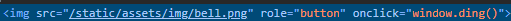
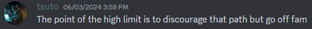
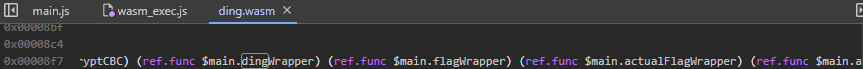
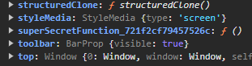
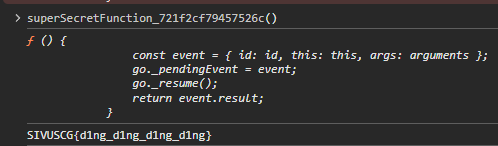

# US Cyber Open 2024: Ding-O-Tron
## Info
**Category**: Web  

## Description
What came first? The ding...or the flag?

## Writeup
On the site, there is a single button. The caption reads, "Untold secrets lie within this bell. Ding it over 9000 times to receive your reward!" When we click the button, the counter above the button increments, which seems to be caused by `window.ding()`:

I assume that autoclicking is not the intended solution in this case...

Next, I tried to find the function `window.ding()` in the source, but the only javascript seems to be running WASM file. Maybe `ding()` is being created by the WASM? Checking for "ding" in the Chrome decompilation of the `ding.wasm` file, we can notice some references to `dingWrapper`. 

Along with it are `flagWrapper` and `actualFlagWrapper`. These might also create functions that display the flag. Let's check for other functions that are accessible from `window`. Some notable functions are `confetti` (shoots confetti) and `giveFlag` (doesn't give the flag). But there is another function that's out of place: `superSecretFunction_721f2cf79457526c`

And calling it gives us the flag!

**`SIVUSCG{d1ng_d1ng_d1ng_d1ng}`**